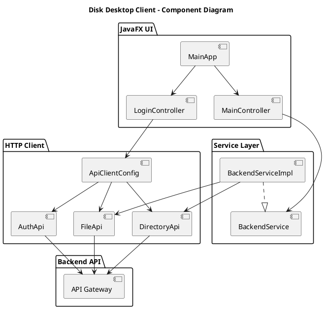
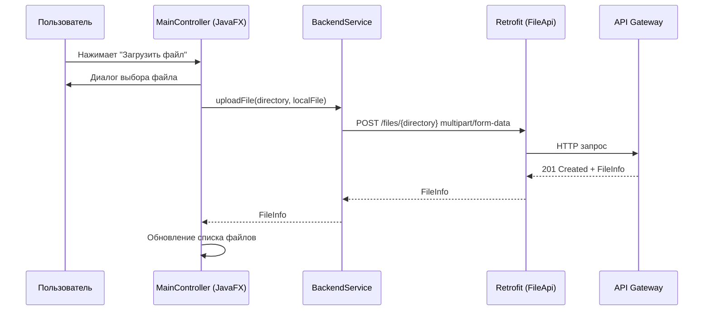

## 1. Описание проекта

**Disk Desktop Client** — это desktop‑клиент на JavaFX (OpenJDK 17), функционально похожий на Cyberduck, но работающий с собственным backend‑ом для хранения файлов через REST API.

Ключевые возможности:
- **Просмотр списка файлов** в выбранной директории.
- **Просмотр списка поддиректорий**.
- **Загрузка файла** в выбранную директорию на backend.
- **Скачивание файла** с backend на локальную машину.
- **Создание новой директории**.
- **Навигация по файловой структуре** (поле пути + кнопка «Вверх», двойной клик по файлу для скачивания).

Технологический стек:
- **Язык**: Java 17 (OpenJDK 17).
- **GUI**: JavaFX (controls + FXML).
- **Сборка**: Gradle (Kotlin DSL).
- **REST‑клиент**: Retrofit 2 + OkHttp 4 + Jackson.
- **Логирование**: SLF4J (simple).
- **Спецификация API**: OpenAPI 3 (`src/main/resources/openapi.yml`).
- **Конфигурация**: файл `~/.diskdesktop/config.properties` + переменная окружения `BACKEND_BASE_URL`.

---

## 2. Архитектура, паттерны и принципы

### 2.1. Высокоуровневый обзор

Архитектура разделена на несколько слоёв:
- **UI (JavaFX)**: `MainApp`, `LoginController`, `MainController`, FXML (`login_view.fxml`, `main_view.fxml`).
- **Сервисный слой**: `BackendService` + `BackendServiceImpl`.
- **HTTP слой**: Retrofit‑интерфейсы `AuthApi`, `FileApi`, `DirectoryApi` и конфигурация `ApiClientConfig`.
- **Модели**: DTO классы `AuthRequest`, `AuthResponse`, `FileInfo`, `DirectoryInfo`, `ErrorResponse`.
- **Конфигурация**: `AppConfig` + `ConfigService` (чтение/запись `~/.diskdesktop/config.properties`).
- **OpenAPI**: контракт backend‑API (`openapi.yml`), независимый от реализации клиента.

Применённые принципы:
- **Separation of Concerns** — UI, сеть и бизнес‑логика разведены по разным пакетам.
- **Dependency Inversion** — UI зависит от абстракции `BackendService`, а не от конкретного HTTP‑клиента.
- **Single Responsibility** — каждый класс отвечает за одну зону (UI, сервис, конфиг, API).
- **Fail Fast и централизованная обработка ошибок** — все сетевые ошибки оборачиваются в `ApiException`.

### 2.2. Диаграмма компонентов (PlantUML)



### 2.3. Диаграмма последовательности (Mermaid)



### 2.4. Используемые паттерны

- **MVC / MVVM‑подобный подход**:
  - Model: `FileInfo`, `DirectoryInfo`.
  - View: `main_view.fxml`.
  - Controller/ViewModel: `MainController`.
- **Gateway/Facade**:
  - `BackendService` скрывает детали Retrofit/OkHttp.
- **Builder / Fluent API** (через сторонние библиотеки):
  - Конфигурация `OkHttpClient` и `Retrofit`.

---

## 3. Endpoint‑ы, контракты и описание

Полный формальный контракт описан в `src/main/resources/openapi.yml` (OpenAPI 3.0.3).

### 3.1. Обзор endpoint‑ов

| Метод | Путь                             | Назначение                                  |
|-------|----------------------------------|---------------------------------------------|
| POST  | `/auth/login`                   | Аутентификация и получение JWT‑токена       |
| GET   | `/files/{directory}`            | Получить список файлов в директории         |
| POST  | `/files/{directory}`            | Загрузить файл в директорию                 |
| GET   | `/files/{directory}/{filename}` | Скачать файл                                |
| GET   | `/directories/{directory}`      | Получить список поддиректорий               |
| POST  | `/directories/{directory}`      | Создать новую поддиректорию                 |

### 3.2. Детальное описание контрактов

#### POST `/auth/login`
- **Описание**: аутентифицирует пользователя и возвращает JWT‑токен.
- **Тело запроса**:
  - Content‑Type: `application/json`
  - Поля (`AuthRequest`):
    - `username` (string, required)
    - `password` (string, required)
- **Успешный ответ (200)**:
  - `AuthResponse`:
    - `token` (string) — JWT‑токен.
- **Ошибки**:
  - `400 BadRequest` → `ErrorResponse`
  - `401 Unauthorized` → `ErrorResponse`
  - `500 InternalError` → `ErrorResponse`

#### GET `/files/{directory}`
- **Описание**: возвращает список файлов в указанной директории.
- **Параметры пути**:
  - `directory` (string, required) — путь директории относительно корня хранилища.
- **Успешный ответ (200)**:
  - Content‑Type: `application/json`
  - Тело: `FileInfo[]`
    - `name` (string)
    - `size` (int64)
    - `lastModified` (date-time)
    - `directory` (string)
- **Ошибки**:
  - `400 BadRequest` → `ErrorResponse`
  - `404 NotFound` → `ErrorResponse`
  - `500 InternalError` → `ErrorResponse`

#### POST `/files/{directory}`
- **Описание**: загружает файл в указанную директорию.
- **Параметры пути**:
  - `directory` (string, required).
- **Тело запроса**:
  - Content‑Type: `multipart/form-data`
  - Поля:
    - `file` (binary, required) — содержимое файла.
- **Успешный ответ (201)**:
  - `FileInfo` (информация о загруженном файле).
- **Ошибки**:
  - `400 BadRequest`, `404 NotFound`, `413 Payload Too Large`, `500 InternalError` → `ErrorResponse`.

#### GET `/files/{directory}/{filename}`
- **Описание**: скачивает файл.
- **Параметры пути**:
  - `directory` (string, required)
  - `filename` (string, required)
- **Успешный ответ (200)**:
  - Content‑Type: `application/octet-stream`
  - Тело: бинарное содержимое файла.
- **Ошибки**:
  - `404 NotFound`, `500 InternalError` → `ErrorResponse`.

#### GET `/directories/{directory}`
- **Описание**: возвращает список поддиректорий.
- **Параметры пути**:
  - `directory` (string, required).
- **Успешный ответ (200)**:
  - `DirectoryInfo[]`
    - `name` (string)
    - `path` (string) — полный путь относительно корня.
- **Ошибки**: `400`, `404`, `500` → `ErrorResponse`.

#### POST `/directories/{directory}`
- **Описание**: создаёт новую поддиректорию в указанной директории.
- **Параметры пути**:
  - `directory` (string, required) — родительская директория.
- **Тело запроса**:
  - Content‑Type: `application/json`
  - Поля:
    - `name` (string, required) — имя новой директории.
- **Успешный ответ (201)**:
  - `DirectoryInfo` (созданная директория).
- **Ошибки**: `400`, `404`, `500` → `ErrorResponse`.

---

## 4. Безопасность

Backend API должен быть развёрнут **за HTTPS**; desktop‑клиент использует URL вида `https://host/api`.

### 4.1. Аутентификация и авторизация

- **Схема аутентификации**: Bearer JWT (см. `components.securitySchemes.bearerAuth` в `openapi.yml`).
- **Клиент**:
  - Перед запуском приложения можно получить JWT токен (через отдельный `/auth/login` endpoint backend‑а).
  - Токен передаётся в `ApiClientConfig` и автоматически добавляется в заголовок `Authorization: Bearer <token>`.
  - Храните токен в зашифрованном виде (например, в OS‑secure storage) — это можно добавить как расширение.

### 4.2. Защита от атак

- **Path Traversal**:
  - Backend обязан валидировать параметры `directory` и `filename` и не допускать выход за пределы корня хранилища (запрещать `..`, абсолютные пути и т.п.).
  - Клиент не формирует пути самовольно, а использует значения, полученные от backend‑а.
- **DoS / brute force**:
  - На стороне backend‑а применяются:
    - rate limiting по IP/токену,
    - ограничение размера загружаемых файлов (см. ответ `413`).
- **Инъекции**:
  - Все параметры обрабатываются как данные, а не как команды; backend использует ORM/подготовленные выражения, если есть БД.
- **Transport Security**:
  - Использовать только `https://` URL.
  - При необходимости валидировать сертификат (pinning).

### 4.3. Практики на стороне клиента

- Не логировать чувствительные данные (токены, пути с конфиденциальной информацией).
- Отображать пользователю только понятные сообщения ошибок, детальную информацию писать в лог.
- Выполнять все сетевые операции в фоновых потоках (через `Task`), не блокируя UI.

---

## 5. Детальное описание модулей архитектуры

### 5.1. Пакет `com.diskdesktop.model`

- **`FileInfo`** — DTO описания файла:
  - `name`, `size`, `lastModified`, `directory`.
- **`DirectoryInfo`** — DTO директории:
  - `name`, `path`.
- **`ErrorResponse`** — описание ошибки backend‑а:
  - `code`, `message`, `details`.

Эти классы отображают схемы из `openapi.yml` и сериализуются/десериализуются Jackson‑ом.

### 5.2. Пакет `com.diskdesktop.api`

- **`FileApi`** (Retrofit):
  - `listFiles(directory)` → `GET /files/{directory}`.
  - `uploadFile(directory, file)` → `POST /files/{directory}` (multipart).
  - `downloadFile(directory, filename)` → `GET /files/{directory}/{filename}`.
- **`DirectoryApi`**:
  - `listDirectories(directory)` → `GET /directories/{directory}`.
  - `createDirectory(directory, body)` → `POST /directories/{directory}`.

Этот слой — тонкая обёртка над HTTP, строго следует OpenAPI‑контракту.

### 5.3. Пакет `com.diskdesktop.config`

- **`ApiClientConfig`**:
  - Создаёт и настраивает `OkHttpClient`:
    - `HttpLoggingInterceptor` (BASIC‑логирование HTTP).
    - `authInterceptor` — автоматически добавляет заголовок `Authorization: Bearer <token>`.
  - Создаёт `Retrofit` с `JacksonConverterFactory`.
  - Предоставляет готовые инстансы `FileApi` и `DirectoryApi`.

Можно расширить:
- Настройками прокси.
- Таймаутами запросов.
- Поддержкой настройки базового URL через конфиг/переменные окружения.

### 5.4. Пакет `com.diskdesktop.service`

- **`BackendService`** — интерфейс высокоуровневого сервиса:
  - `listFiles`, `listDirectories`, `uploadFile`, `downloadFile`, `createDirectory`.
- **`BackendServiceImpl`**:
  - Реализует методы интерфейса через `FileApi` и `DirectoryApi`.
  - Инкапсулирует:
    - создание multipart‑запросов;
    - обработку кодов ответов;
    - скачивание файлов на диск.
  - Все ошибки оборачивает в `ApiException`.
- **`ApiException`**:
  - Содержит `statusCode` и `rawBody` (тело ошибки), чтобы можно было логировать детали.

Таким образом, UI‑слой не знает ни про Retrofit, ни про HTTP‑коды, а получает управляемые исключения.

### 5.5. Пакет `com.diskdesktop.ui`

- **`MainController`**:
  - Привязан к FXML `main_view.fxml`.
  - Управляет:
    - `TreeView<DirectoryInfo>` — дерево директорий (в примере используется упрощённо, можно расширить).
    - `TableView<FileInfo>` — список файлов.
    - Toolbar: путь, кнопки «Вверх», «Создать директорию», «Загрузить файл», «Обновить».
    - Нижняя панель: `ProgressBar` и `Label` для статуса.
  - Все длительные операции (список файлов, загрузка, скачивание, создание директории) выполняются через `runTask(...)`:
    - Внутри создаётся `Task`, который запускается в отдельном демоне‑потоке.
    - Прогресс бар переводится в indeterminate режим, статус обновляется через `messageProperty`.
    - Ошибки отображаются через `Alert` (диалог ошибки).
  - Двойной клик по файлу в таблице открывает диалог сохранения и инициирует скачивание.

- **`main_view.fxml`**:
  - Описывает layout через `BorderPane`:
    - `top`: `ToolBar`.
    - `center`: `SplitPane` с деревом директорий и таблицей файлов.
    - `bottom`: `HBox` с прогресс‑баром и статусом.

### 5.6. Root‑класс и запуск приложения

- **`Main`**:
  - Стандартная `public static void main(String[] args)`; делегирует запуск `MainApp` через `Application.launch`.
- **`MainApp`**:
  - Загружает FXML, создаёт `Scene`, инициализирует `MainController`.
  - Создаёт `ApiClientConfig` и `BackendServiceImpl` и передаёт их в контроллер.

---

## 6. Сборка и развёртывание

### 6.1. Зависимости Gradle

В `build.gradle.kts` используются следующие зависимости:

- JavaFX:
  - `id("org.openjfx.javafxplugin") version "0.1.0"`
  - `javafx { version = "21"; modules = listOf("javafx.controls", "javafx.fxml") }`
- Retrofit/OkHttp:
  - `implementation("com.squareup.retrofit2:retrofit:2.11.0")`
  - `implementation("com.squareup.retrofit2:converter-jackson:2.11.0")`
  - `implementation("com.squareup.okhttp3:logging-interceptor:4.12.0")`
- Jackson:
  - `implementation("com.fasterxml.jackson.core:jackson-databind:2.17.2")`
- Логирование:
  - `implementation("org.slf4j:slf4j-simple:2.0.13")`

### 6.2. Требования к окружению

- **JDK**: OpenJDK 17 (или совместимый).
- **OS**: Astra Linux / любая современная Linux‑система с поддержкой JavaFX.
- **Gradle**: рекомендуется использовать Gradle Wrapper (`./gradlew`), поставляемый с проектом.

Для Astra Linux:
- Установите JDK 17 (`sudo apt install openjdk-17-jdk` или аналог).
- Убедитесь, что `JAVA_HOME` указывает на JDK 17.

### 6.3. Сборка проекта

Из корня проекта:

```bash
./gradlew clean build
```

Тесты (по необходимости):

```bash
./gradlew test
```

### 6.4. Запуск из Gradle

Приложение настроено через `application` plugin:

```bash
./gradlew run
```

При запуске ожидается, что backend API доступен по адресу `http://localhost:8080/api`
(или ином URL, указанном при создании `ApiClientConfig` в `MainApp`).

### 6.5. Запуск собранного приложения

Вариант 1: `run` через Gradle (см. выше).

Вариант 2: создать дистрибутив:

```bash
./gradlew installDist
```

Будет создана директория:

- `build/install/<project-name>/bin/`

Запуск (имя директории/скрипта зависит от `rootProject.name`):

```bash
./build/install/<project-name>/bin/<project-name>
```

> Примечание: при необходимости можно добавить плагин для сборки fat‑jar (например, Shadow) или использовать `jlink` для создания минимального runtime‑образа под Astra Linux.

---

## 7. Docker и docker-compose

### 7.1. Цели контейнеризации

- **Воспроизводимая сборка**: запуск `./gradlew clean build` внутри стандартизированного образа JDK 17.
- **Упрощённый запуск**: возможность собрать и запустить JavaFX‑клиент из Docker‑образа (с учётом ограничений GUI).

> Для полноценной работы GUI из контейнера на Linux потребуется проброс X11‑сокета
> или использование VNC/Wayland‑решений. Ниже приведён базовый пример через X11‑проброс
> (закомментирован в `docker-compose.yml`).

### 7.2. Dockerfile

В корне проекта расположен `Dockerfile` с двумя стадиями:

- **build‑стадия** (`eclipse-temurin:17-jdk`):
  - Копирует Gradle wrapper, `build.gradle.kts`, директорию `gradle/`.
  - Прогревает кеш зависимостей.
  - Копирует исходники из `src/`.
  - Выполняет `./gradlew clean build`.
- **runtime‑стадия** (`eclipse-temurin:17-jre`):
  - Копирует скомпилированный `app.jar` из build‑стадии.
  - Стартует приложение командой `java -jar app.jar`.

Сборка образа вручную:

```bash
docker build -t disk-desktop-client:latest .
```

### 7.3. docker-compose

Файл `docker-compose.yml` содержит один сервис:

- **disk-desktop-client**
  - `build: .` — сборка образа по `Dockerfile`.
  - `image: disk-desktop-client:latest` — тег образа.
  - `environment`:
    - `BACKEND_BASE_URL=http://host.docker.internal:8080/api` — пример URL backend‑а (пока не используется кодом, но может быть легко интегрирован).
  - Закомментированные строки для X11‑проброса при необходимости.

Запуск сборки и контейнера:

```bash
docker-compose build
docker-compose up
```

> Обратите внимание: запуск JavaFX‑GUI внутри контейнера потребует дополнительной настройки
> окружения (DISPLAY, проброс сокетов и пр.). Для разработки и обычного использования
> удобнее запускать приложение напрямую на хосте (через `./gradlew run`).

---

## 8. CI/CD (GitHub Actions)

### 8.1. Цели CI

- Гарантировать успешную сборку проекта и прохождение тестов при каждом `push`/`pull_request`.
- Автоматически собирать артефакты (JAR‑файлы), которые можно скачать из интерфейса GitHub.

### 8.2. Workflow `ci.yml`

Файл `.github/workflows/ci.yml` описывает job `build`:

- **Триггеры**:
  - `push` в ветки `main` и `master`;
  - `pull_request` в ветки `main` и `master`.
- **Окружение**:
  - `runs-on: ubuntu-latest`.
  - Используется `actions/setup-java@v4` с:
    - `java-version: 17`;
    - `distribution: temurin`;
    - `cache: gradle` для ускорения повторных сборок.
- **Шаги**:
  - Checkout репозитория (`actions/checkout@v4`).
  - Выдача прав на запуск `gradlew` (`chmod +x gradlew`).
  - Сборка проекта:

    ```bash
    ./gradlew clean build --no-daemon
    ```

  - Архивация артефактов:
    - Используется `actions/upload-artifact@v4`.
    - Артефакты: `build/libs/*.jar`.

### 8.3. Возможные расширения CD

Дальнейшие шаги, которые можно добавить:

- Сборка и публикация Docker‑образа в GitHub Container Registry (`ghcr.io`).
- Автоматический деплой backend‑сервиса (если он лежит в том же репозитории).
- Отдельные workflow‑файлы для nightly‑сборок, релизов и т.п.

---


